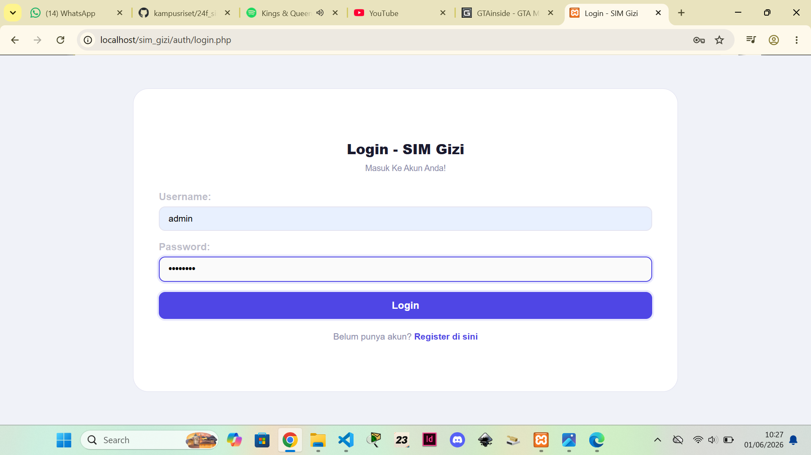
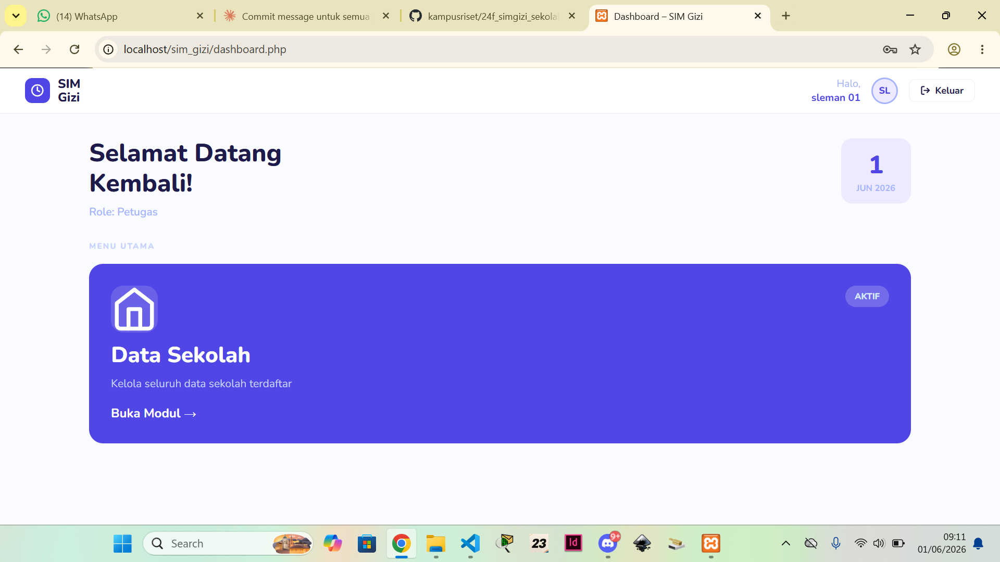
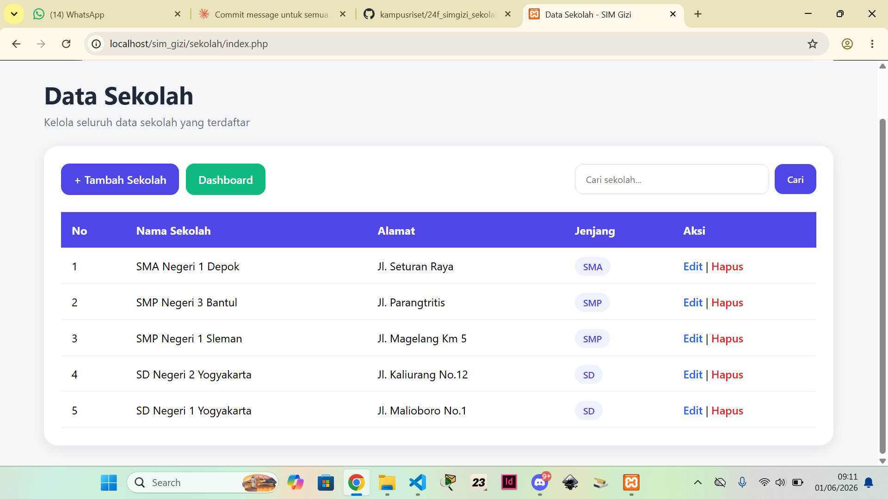
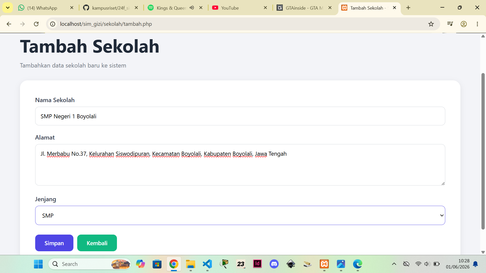

# 🥗 SIM Gizi Sekolah

Sistem Informasi Manajemen Gizi Sekolah berbasis web yang dibangun menggunakan PHP Native dan MySQL. Aplikasi ini dirancang untuk mengelola data distribusi makanan bergizi kepada penerima manfaat di lingkungan sekolah.

---

## 📋 Deskripsi Aplikasi

SIM Gizi (Sistem Informasi Gizi) merupakan aplikasi berbasis web yang dirancang untuk membantu proses pengelolaan dan pendataan informasi yang berkaitan dengan program gizi secara lebih terstruktur, cepat, dan efisien. Aplikasi ini dikembangkan sebagai sarana digital untuk menggantikan proses pencatatan manual yang sering menimbulkan berbagai permasalahan, seperti kesalahan pencatatan, duplikasi data, serta kesulitan dalam pencarian dan pengelolaan informasi.

Melalui sistem ini, pengguna dapat melakukan pengelolaan data sekolah yang menjadi bagian dari program gizi, mulai dari proses penambahan data, pengubahan data, penghapusan data, hingga pencarian data berdasarkan kebutuhan. Seluruh informasi tersimpan dalam database sehingga data dapat diakses kembali dengan mudah kapan saja tanpa harus melakukan pencarian secara manual pada dokumen fisik.

SIM Gizi juga dilengkapi dengan fitur autentikasi pengguna yang memungkinkan hanya pengguna yang memiliki akun dan hak akses tertentu yang dapat masuk ke dalam sistem. Dengan adanya mekanisme login dan manajemen sesi pengguna, keamanan data menjadi lebih terjamin serta mengurangi risiko akses oleh pihak yang tidak berwenang.

Aplikasi ini dibangun menggunakan bahasa pemrograman PHP dengan dukungan database MySQL sebagai media penyimpanan data. Antarmuka yang sederhana dan mudah digunakan memungkinkan pengguna untuk mengoperasikan sistem tanpa memerlukan pelatihan khusus. Selain itu, sistem dirancang agar dapat dijalankan pada lingkungan web server lokal seperti XAMPP maupun Laragon sehingga memudahkan proses implementasi dan pengembangan.

Dengan adanya SIM Gizi, proses pengelolaan data menjadi lebih efektif, efisien, dan terorganisir. Sistem ini diharapkan dapat membantu pengguna dalam melakukan pendataan, monitoring, serta pengelolaan informasi secara digital sehingga mendukung peningkatan kualitas administrasi dan pengambilan keputusan yang lebih tepat berdasarkan data yang tersedia.

---

## ✨ Fitur Aplikasi

1. Login pengguna
2. Registrasi akun
3. Logout sistem
4. Dashboard utama
5. Menampilkan data sekolah
6. Menambah data sekolah
7. Mengubah data sekolah
8. Menghapus data sekolah
9. Pencarian data sekolah
10. Manajemen pengguna berbasis session

---

## 🚀 Cara Menjalankan Aplikasi

### Prasyarat
- PHP >= 7.4
- MySQL / MariaDB
- Web server (Apache/Nginx) atau XAMPP/Laragon

### Langkah Instalasi

1. **Clone atau download** repository ini ke folder web server:
   ```
   htdocs/sim_gizi/   ← untuk XAMPP
   www/sim_gizi/      ← untuk Laragon
   ```

2. **Import database** — Buka phpMyAdmin atau MySQL CLI, lalu jalankan file SQL:
   ```sql
   SOURCE /path/to/database.sql;
   ```
   Atau salin isi `database.sql` dan jalankan di phpMyAdmin.

3. **Konfigurasi koneksi** — Edit file `config/database.php` sesuaikan host, username, password, dan nama database:
   ```php
   $host     = 'localhost';
   $db       = 'sim_gizi';
   $user     = 'root';
   $password = '';
   ```

4. **Setup akun admin** — Jika password belum ter-hash dengan benar, akses:
   ```
   http://localhost/sim_gizi/fix_password.php
   ```
   Hapus file ini setelah digunakan.

5. **Akses aplikasi** di browser:
   ```
   http://localhost/sim_gizi/
   ```

6. **Login** menggunakan kredensial default:
   - Username: `admin`
   - Password: `admin123`

> **Tips:** Akses `test_db.php` untuk mendiagnosis koneksi database jika terjadi masalah. Hapus file `test_db.php` dan `fix_password.php` setelah aplikasi berjalan di lingkungan produksi.

---

## 🗄️ Struktur Database

Database: `sim_gizi`

| Tabel | Deskripsi |
|---|---|
| `users` | Akun pengguna dengan role (admin, petugas, dapur, sekolah) |
| `sekolah` | Data sekolah terdaftar beserta jenjang dan alamat |
| `penerima_manfaat` | Siswa/penerima program gizi, terhubung ke sekolah |
| `menu_makanan` | Daftar menu (Sarapan/Siang) beserta tanggal saji |
| `kandungan_gizi` | Nilai gizi per menu (kalori, protein, lemak, karbohidrat) |
| `mitra` | Mitra/vendor penyedia makanan dengan status verifikasi |
| `dapur` | Dapur produksi yang terhubung ke mitra |
| `distribusi` | Catatan distribusi porsi dari dapur ke sekolah per tanggal |
| `distribusi_detail` | Detail menu dalam setiap distribusi |
| `absensi` | Rekap kehadiran penerima manfaat |
| `keluhan` | Keluhan penerima manfaat dengan status penanganan |
| `petugas` | Data petugas lapangan per wilayah |
| `penilaian_makanan` | Penilaian dan komentar pengguna terhadap menu |

### Relasi Database

```
Struktur Pohon Relasi:


sekolah
│
├── penerima_manfaat
│   ├── absensi
│   └── keluhan
│
└── distribusi
    └── distribusi_detail
        └── menu_makanan
            ├── kandungan_gizi
            └── penilaian_makanan


mitra
│
└── dapur
    │
    └── distribusi


Tabel Relasi:
+----------------------+--------------------+------------------+
| Tabel Asal           | Tabel Tujuan       | Kardinalitas     |
+----------------------+--------------------+------------------+
| sekolah              | penerima_manfaat   | One to Many      |
| sekolah              | distribusi         | One to Many      |
| menu_makanan         | kandungan_gizi     | One to One/Many  |
| menu_makanan         | distribusi_detail  | One to Many      |
| menu_makanan         | penilaian_makanan  | One to Many      |
| distribusi           | distribusi_detail  | One to Many      |
| mitra                | dapur              | One to Many      |
| dapur                | distribusi         | One to Many      |
| penerima_manfaat     | absensi            | One to Many      |
| penerima_manfaat     | keluhan            | One to Many      |
+----------------------+--------------------+------------------+
```

### DDL Lengkap

```sql
CREATE DATABASE sim_gizi;
USE sim_gizi;

CREATE TABLE sekolah (
    id_sekolah INT AUTO_INCREMENT PRIMARY KEY,
    nama_sekolah VARCHAR(150) NOT NULL,
    alamat TEXT,
    jenjang VARCHAR(20)
);

CREATE TABLE penerima_manfaat (
    id_penerima INT AUTO_INCREMENT PRIMARY KEY,
    nama VARCHAR(100) NOT NULL,
    nik VARCHAR(20) UNIQUE,
    id_sekolah INT,
    alamat TEXT,
    status VARCHAR(20),
    CONSTRAINT fk_penerima_sekolah FOREIGN KEY (id_sekolah) REFERENCES sekolah (id_sekolah) ON UPDATE CASCADE ON DELETE SET NULL
);

CREATE TABLE menu_makanan (
    id_menu INT AUTO_INCREMENT PRIMARY KEY,
    nama_menu VARCHAR(100) NOT NULL,
    jenis ENUM('Sarapan', 'Siang') NOT NULL,
    tanggal_menu DATE
);

CREATE TABLE kandungan_gizi (
    id_gizi INT AUTO_INCREMENT PRIMARY KEY,
    id_menu INT,
    kalori DECIMAL(10,2),
    protein DECIMAL(10,2),
    lemak DECIMAL(10,2),
    karbohidrat DECIMAL(10,2),
    CONSTRAINT fk_gizi_menu FOREIGN KEY (id_menu) REFERENCES menu_makanan (id_menu) ON UPDATE CASCADE ON DELETE CASCADE
);

CREATE TABLE mitra (
    id_mitra INT AUTO_INCREMENT PRIMARY KEY,
    nama_mitra VARCHAR(100),
    jenis VARCHAR(50),
    alamat TEXT,
    status_verifikasi ENUM('Pending', 'Terverifikasi', 'Ditolak')
);

CREATE TABLE dapur (
    id_dapur INT AUTO_INCREMENT PRIMARY KEY,
    nama_dapur VARCHAR(100),
    alamat TEXT,
    penanggung_jawab VARCHAR(100),
    kontak VARCHAR(20),
    id_mitra INT,
    CONSTRAINT fk_dapur_mitra FOREIGN KEY (id_mitra) REFERENCES mitra (id_mitra) ON UPDATE CASCADE ON DELETE SET NULL
);

CREATE TABLE distribusi (
    id_distribusi INT AUTO_INCREMENT PRIMARY KEY,
    tanggal DATE,
    id_sekolah INT,
    id_dapur INT,
    jumlah_porsi INT,
    CONSTRAINT fk_distribusi_sekolah FOREIGN KEY (id_sekolah) REFERENCES sekolah (id_sekolah) ON UPDATE CASCADE ON DELETE SET NULL,
    CONSTRAINT fk_distribusi_dapur FOREIGN KEY (id_dapur) REFERENCES dapur (id_dapur) ON UPDATE CASCADE ON DELETE SET NULL
);

CREATE TABLE distribusi_detail (
    id_detail INT AUTO_INCREMENT PRIMARY KEY,
    id_distribusi INT,
    id_menu INT,
    qty INT,
    CONSTRAINT fk_detail_distribusi FOREIGN KEY (id_distribusi) REFERENCES distribusi (id_distribusi) ON UPDATE CASCADE ON DELETE CASCADE,
    CONSTRAINT fk_detail_menu FOREIGN KEY (id_menu) REFERENCES menu_makanan (id_menu) ON UPDATE CASCADE ON DELETE CASCADE
);

CREATE TABLE absensi (
    id_absensi INT AUTO_INCREMENT PRIMARY KEY,
    id_penerima INT,
    tanggal DATE,
    status_hadir ENUM('Hadir', 'Tidak Hadir'),
    CONSTRAINT fk_absensi_penerima FOREIGN KEY (id_penerima) REFERENCES penerima_manfaat (id_penerima) ON UPDATE CASCADE ON DELETE CASCADE
);

CREATE TABLE keluhan (
    id_keluhan INT AUTO_INCREMENT PRIMARY KEY,
    id_penerima INT,
    isi_keluhan TEXT,
    tanggal DATE,
    status_keluhan ENUM('Masuk', 'Diproses', 'Selesai'),
    CONSTRAINT fk_keluhan_penerima FOREIGN KEY (id_penerima) REFERENCES penerima_manfaat (id_penerima) ON UPDATE CASCADE ON DELETE CASCADE
);

CREATE TABLE petugas (
    id_petugas INT AUTO_INCREMENT PRIMARY KEY,
    nama VARCHAR(100),
    wilayah VARCHAR(100),
    nomor_hp VARCHAR(20),
    jabatan VARCHAR(50)
);

CREATE TABLE penilaian_makanan (
    id_penilaian INT AUTO_INCREMENT PRIMARY KEY,
    id_menu INT,
    nilai INT CHECK (nilai BETWEEN 1 AND 5),
    komentar TEXT,
    CONSTRAINT fk_penilaian_menu FOREIGN KEY (id_menu) REFERENCES menu_makanan (id_menu) ON UPDATE CASCADE ON DELETE CASCADE
);

CREATE TABLE users (
    id_user INT AUTO_INCREMENT PRIMARY KEY,
    nama VARCHAR(100),
    username VARCHAR(50) UNIQUE,
    password VARCHAR(255),
    role ENUM('admin', 'petugas', 'dapur', 'sekolah') NOT NULL,
    created_at TIMESTAMP DEFAULT CURRENT_TIMESTAMP
);
```

---

## 📸 Screenshot Tampilan Aplikasi

> screenshot tampilan aplikasi setelah berjalan.

**Halaman Login**


**Dashboard**


**Data Sekolah**


**Menambah Data Sekolah**


---

## 🛠️ Teknologi

- **Backend:** PHP Native
- **Database:** MySQL / MariaDB
- **Frontend:** HTML, CSS (custom), JavaScript
- **Server:** Apache (XAMPP/Laragon)

---